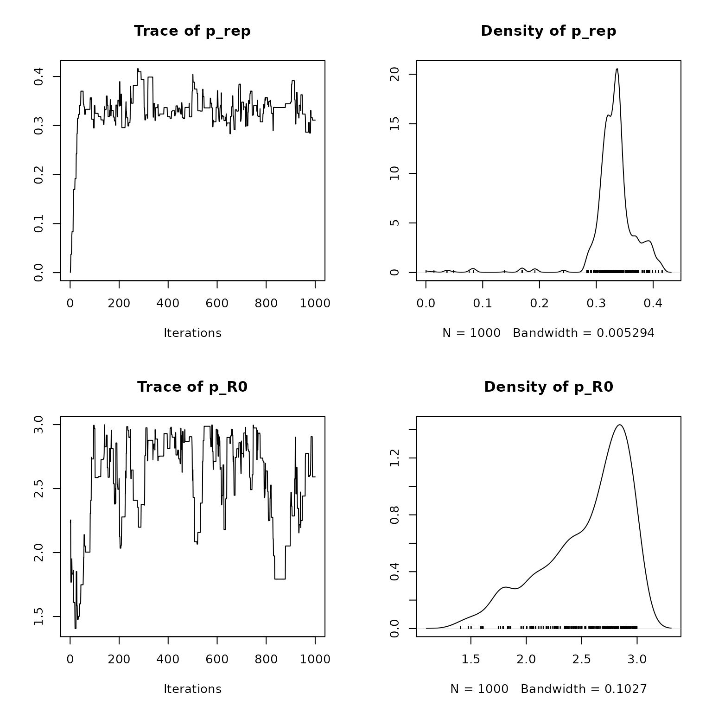
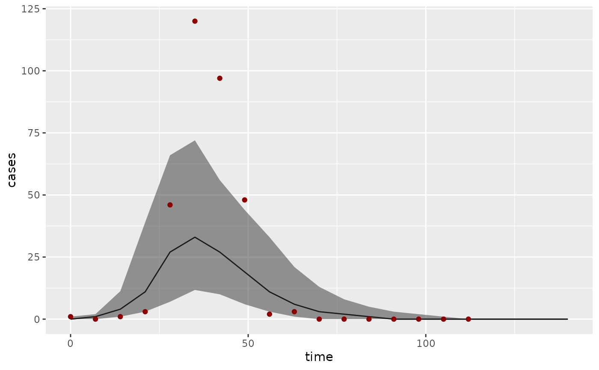
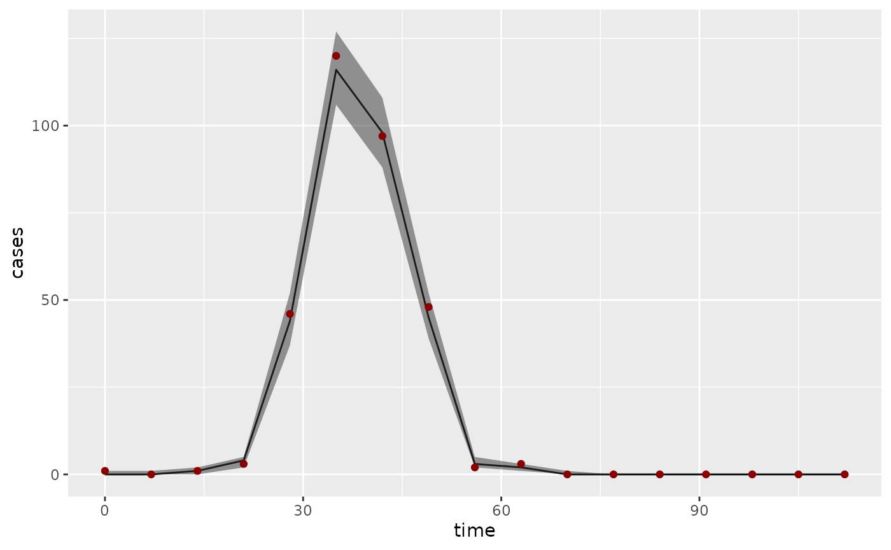

# Introduction to rbi

This vignette gives an introduction to using **rbi**. For the best
viewing experience, use the [version on the rbi
website](https://sbfnk.github.io/rbi/articles/introduction.html).

[rbi](https://github.com/sbfnk/rbi) is an `R` interface to
[LibBi](https://libbi.org), a library for Bayesian inference with
state-space models using high-performance computer hardware.

The package has been tested on macOS and Linux. It requires a working
installation of **LibBi**. On macOS, this is easiest done using the
`brew` command: Install [Homebrew](https://brew.sh), then issue the
following command (using a command shell, i.e. Terminal or similar):

``` sh
brew install libbi
```

On linux, follow the
[instructions](https://github.com/lawmurray/LibBi/blob/master/INSTALL_LINUX.md)
provided with LibBi.

If you have any trouble installing **LibBi** you can get help on the
[LibBi Users](https://groups.google.com/forum/#!forum/libbi-users)
mailing list.

The path to the `libbi` script can be passed as an argument to **rbi**,
otherwise the package tries to find it automatically using the `which`
linux/unix command.

If you just want to process the output from **LibBi**, then you do not
need to have **LibBi** installed.

## Installation

The easiest way to install the latest stable version of **rbi** is via
CRAN.

``` r
install.packages("rbi")
```

Alternatively, the current development version can be installed using
the `remotes` package

``` r
remotes::install_github("sbfnk/rbi")
```

## Loading the package

Use

``` r
library("rbi")
```

to load the package.

## Getting started

The main computational engine and model grammar behind **rbi** is
provided by **LibBi**. The [LibBi
manual](https://libbi.org/docs/LibBi-Manual.pdf) is a good place to
start for finding out everything there is to know about **LibBi** models
and inference methods.

The **rbi** package mainly provides two classes: `bi_model` and `libbi`.
The `bi_model` class is used to load, view and manipulate **LibBi**
model files. The `libbi` class is used to run LibBi and perform
inference.

The package also provides two methods for interacting with the
[NetCDF](https://www.unidata.ucar.edu/software/netcdf/) files used by
**LibBi**, `bi_read` and `bi_write`. Lastly, it provides a `get_traces`
function to analyse Markov-chain Monte Carlo (MCMC) traces using the
[coda](https://cran.r-project.org/package=coda) package.

## The `bi_model` class

As an example, we consider a simplified version of the SIR model
discussed in [Del Moral et al. (2014)](https://arxiv.org/abs/1405.4081).
This is included with the **rbi** package and can be loaded with

``` r
model_file <- system.file(package = "rbi", "SIR.bi")
sir_model <- bi_model(model_file) # load model
```

Other ways of implementing a (deterministic or stochastic) SIR model can
be found in the [collection of SIR models for
LibBi](https://sbfnk.github.io/rbi/articles/idd_models.md), where you
also find how to load them into a `bi_model` object, e.g. `sir_model`.
Feel free to run the commands below with different versions of the
model.

The `sir_model` object now contains the model, which can be displayed
with

``` r
sir_model
#> bi_model:
#> =========
#>  1: model SIR {
#>  2:   const h = 7
#>  3:   const N = 1000
#>  4:   const d_infection = 14
#>  5:   noise n_transmission
#>  6:   noise n_recovery
#>  7:   state S
#>  8:   state I
#>  9:   state R
#> 10:   state Z
#> 11:   obs Incidence
#> 12:   param p_rep
#> 13:   param p_R0
#> 14:   sub parameter {
#> 15:     p_rep ~ uniform(0,1)
#> 16:     p_R0 ~ uniform(1,3)
#> 17:   }
#> 18:   sub initial {
#> 19:     S <- N - 1
#> 20:     I <- 1
#> 21:     R <- 0
#> 22:     Z <- 1
#> 23:   }
#> 24:   sub transition {
#> 25:     n_transmission ~ wiener()
#> 26:     n_recovery ~ wiener()
#> 27:     Z <- (t_now % 7 == 0 ? 0 : Z)
#> 28:     inline i_beta = p_R0 / d_infection * exp(n_transmission)
#> 29:     inline i_gamma = 1 / d_infection * exp(n_recovery)
#> 30:     ode (alg='RK4(3)', h=1e-1, atoler=1e-2, rtoler=1e-5) {
#> 31:       dS/dt = - i_beta * S * I / N
#> 32:       dI/dt = i_beta * S * I / N - i_gamma * I
#> 33:       dR/dt = i_gamma * I
#> 34:       dZ/dt = i_beta * S * I / N
#> 35:     }
#> 36:   }
#> 37:   sub observation {
#> 38:     Incidence ~ poisson(p_rep * Z)
#> 39:   }
#> 40:   sub proposal_initial {
#> 41:     S <- N - 1
#> 42:     I <- 1
#> 43:     R <- 0
#> 44:     Z <- 1
#> 45:   }
#> 46:   sub proposal_parameter {
#> 47:     p_rep ~ truncated_gaussian(mean = p_rep, std = 0.03, lower = 0, upper = 1)
#> 48:     p_R0 ~ truncated_gaussian(mean = p_R0, std = 0.2, lower = 1, upper = 3)
#> 49:   }
#> 50: }
```

A part of the model can be shown with, for example,

``` r
sir_model[35:38]
#> [1] "}"                              "}"                             
#> [3] "sub observation {"              "Incidence ~ poisson(p_rep * Z)"
```

or, for example,

``` r
get_block(sir_model, "parameter")
#> [1] "p_rep ~ uniform(0,1)" "p_R0 ~ uniform(1,3)"
```

To get a list of certain variables, you can use the `var_names`
function. For example, to get a list of states, you can use

``` r
var_names(sir_model, type = "state")
#> [1] "S" "I" "R" "Z"
```

There are also various methods for manipulating a model, such as
`remove_lines`, `insert_line`, `replace_all`.

The `fix` method fixes a variable to one value. This can be useful, for
example, to run the deterministic equivalent of a stochastic model for
testing purposes:

``` r
det_sir_model <- fix(sir_model, n_transmission = 0, n_recovery = 0)
```

To get documentation for any of these methods, use the links in the
documentation for `bi_model`.

## Generating a dataset

First, let’s create a data set from the SIR model.

``` r
set.seed(1001912)
sir_data <- generate_dataset(sir_model, end_time = 16 * 7, noutputs = 16)
```

This simulates the model a single time from time 0 until time 16\*7
(say, 16 weeks with a daily time step), producing 16 outputs (one a
week). Note that we have specified a random seed to make this document
reproducible. If you omit the `set.seed` command or set it to a
different number, the results will be different even when run with the
same set of commands. Also note that *LibBi* compiles the model code
only the first time it is run. If you run the command above a second
time, it should run much faster.

The `generate_dataset` function returns a `libbi` object:

``` r
sir_data
#> Wrapper around LibBi
#> ======================
#> Model:  SIR 
#> Run time:  0.002274  seconds
#> Number of samples:  1 
#> State trajectories recorded:  S I R Z 
#> Noise trajectories recorded:  n_transmission n_recovery 
#> Observation trajectories recorded:  Incidence 
#> Parameters recorded:  p_rep p_R0
```

The generated dataset can be viewed and/or stored in a variable using
`bi_read`:

``` r
dataset <- bi_read(sir_data)
```

The `bi_read` function takes the name of a NetCDF file or a `libbi`
object (in which case it locates the output file) and stores the
contents in a list of data frames or vectors, depending on the
dimensionality of the contents. Note that, if no `working_folder` is
specified, the model and output files will be stored in a temporary
folder.

``` r
names(dataset)
#>  [1] "n_transmission" "n_recovery"     "S"              "I"             
#>  [5] "R"              "Z"              "Incidence"      "p_rep"         
#>  [9] "p_R0"           "clock"
dataset$p_R0
#>      value
#> 1 2.269623
dataset$Incidence
#>    time value
#> 1     0     1
#> 2     7     0
#> 3    14     1
#> 4    21     3
#> 5    28    46
#> 6    35   120
#> 7    42    97
#> 8    49    48
#> 9    56     2
#> 10   63     3
#> 11   70     0
#> 12   77     0
#> 13   84     0
#> 14   91     0
#> 15   98     0
#> 16  105     0
#> 17  112     0
```

We can visualise the generated incidence data with

``` r
plot(dataset$Incidence$time, dataset$Incidence$value)
lines(dataset$Incidence$time, dataset$Incidence$value)
```


## The `libbi` class

The `libbi` class manages the interaction with **LibBi** such as
sampling from the prior or posterior distribution. For example, the
`sir_data` object above is of type `libbi`:

``` r
class(sir_data)
#> [1] "libbi"
```

Th `bi_generate_dataset` is one particular way of generating a `libbi`
object, used only to generate test data from a model. The standard way
of creating a `libbi` object for Bayesian inference is using the `libbi`
command

``` r
bi <- libbi(sir_model)
```

This initialises a `libbi` object with the model created earlier and
assigns it to the variable `bi`.

``` r
class(bi)
#> [1] "libbi"
```

Let’s sample from the prior of the SIR model:

``` r
bi_prior <- sample(
  bi, target = "prior", nsamples = 1000, end_time = 16 * 7, noutputs = 16
)
```

This step calls **LibBi** to sample from the prior distribution of the
previously specified model, generating 1,000 samples and each time
running the model for 16 \* 7 = 112 time steps and writing 16 outputs
(i.e., every 7 time steps). **LibBi** parses the model, creates C++
code, compiles it and run the model. If the model is run again, it
should do so much quicker because it will use the already compiled C++
code to run the model:

``` r
bi_prior <- sample(bi_prior)
```

The `sample` command returns an updated `libbi` object which, in this
case, we just assign again to the `bi` object. Any call of `sample`
preserves options passed to the previous call of `sample` and `libbi`,
unless they are overwritten by arguments passed to `sample` (e.g.,
passing a new `nsamples` argument). Let’s have a closer look at the `bi`
object:

``` r
bi_prior
#> Wrapper around LibBi
#> ======================
#> Model:  SIR 
#> Run time:  0.055978  seconds
#> Number of samples:  1000 
#> State trajectories recorded:  S I R Z 
#> Noise trajectories recorded:  n_transmission n_recovery 
#> Parameters recorded:  p_rep p_R0
```

To see even more detail, try

``` r
str(bi_prior)
#> List of 21
#>  $ options         :List of 5
#>   ..$ build-dir: chr "/tmp/Rtmpgdlwmo/SIR3ee1513ca80d"
#>   ..$ seed     : num 1.96e+09
#>   ..$ nsamples : num 1000
#>   ..$ end-time : num 112
#>   ..$ noutputs : num 16
#>  $ path_to_libbi   : chr "/usr/local/bin/libbi"
#>  $ model           : 'bi_model' chr [1:50] "model SIR {" "const h = 7" "const N = 1000" "const d_infection = 14" ...
#>  $ model_file_name : chr "/tmp/Rtmpgdlwmo/SIR3ee1513ca80d/SIR.bi"
#>  $ dims            : list()
#>  $ time_dim        : chr(0) 
#>  $ coord_dims      : list()
#>  $ thin            : num 1
#>  $ output_every    : num NA
#>  $ debug           : logi FALSE
#>  $ command         : chr "/usr/local/bin/libbi sample --build-dir /tmp/Rtmpgdlwmo/SIR3ee1513ca80d --seed 1955227312 --target prior --nsam"| __truncated__
#>  $ output_file_name: chr "/tmp/Rtmpgdlwmo/SIR3ee1513ca80d/SIR_output3ee1246c7fe8.nc"
#>  $ log_file_name   : chr "/tmp/Rtmpgdlwmo/SIR3ee1513ca80d/output3ee1301e3b08.txt"
#>  $ user_log_file   : logi FALSE
#>  $ timestamp       :List of 1
#>   ..$ output: POSIXct[1:1], format: "2026-01-20 15:14:05"
#>  $ run_flag        : logi TRUE
#>  $ error_flag      : logi FALSE
#>  $ use_cache       : logi TRUE
#>  $ supplement      : NULL
#>  $ .gc_env         :<environment: 0x55e623dbf030> 
#>  $ .cache          :<environment: 0x55e624cadd98> 
#>  - attr(*, "class")= chr "libbi"
```

We can see the object contains 14 fields, including the model, the path
to the `libbi` script, and the command used to run libbi (`bi$command`);
the `options` field contains all the options that **LibBi** was called
with. This includes the ones we passed to `sample`

``` r
bi_prior$options
#> $`build-dir`
#> [1] "/tmp/Rtmpgdlwmo/SIR3ee1513ca80d"
#> 
#> $seed
#> [1] 1955227312
#> 
#> $nsamples
#> [1] 1000
#> 
#> $`end-time`
#> [1] 112
#> 
#> $noutputs
#> [1] 16
```

The other fields contain various bits of information about the object,
including the model used, the command used to run **LibBi**
(`bi$command`) and the output file name:

``` r
bi_prior$output_file_name
#> [1] "/tmp/Rtmpgdlwmo/SIR3ee1513ca80d/SIR_output3ee1246c7fe8.nc"
```

We can get the results of the sampling run using `bi_read`

``` r
prior <- bi_read(bi_prior$output_file_name)
```

or with the shorthand

``` r
prior <- bi_read(bi_prior)
```

which looks at the `output_file_name` field to read in the data. Let’s
look at the returned object

``` r
str(prior)
#> List of 9
#>  $ n_transmission:'data.frame':  17000 obs. of  3 variables:
#>   ..$ np   : num [1:17000] 0 0 0 0 0 0 0 0 0 0 ...
#>   ..$ time : num [1:17000] 0 7 14 21 28 35 42 49 56 63 ...
#>   ..$ value: num [1:17000] 0 0.136 -1.287 1.181 -1.073 ...
#>  $ n_recovery    :'data.frame':  17000 obs. of  3 variables:
#>   ..$ np   : num [1:17000] 0 0 0 0 0 0 0 0 0 0 ...
#>   ..$ time : num [1:17000] 0 7 14 21 28 35 42 49 56 63 ...
#>   ..$ value: num [1:17000] 0 0.471 0.725 0.87 0.115 ...
#>  $ S             :'data.frame':  17000 obs. of  3 variables:
#>   ..$ np   : num [1:17000] 0 0 0 0 0 0 0 0 0 0 ...
#>   ..$ time : num [1:17000] 0 7 14 21 28 35 42 49 56 63 ...
#>   ..$ value: num [1:17000] 999 998 997 991 986 ...
#>  $ I             :'data.frame':  17000 obs. of  3 variables:
#>   ..$ np   : num [1:17000] 0 0 0 0 0 0 0 0 0 0 ...
#>   ..$ time : num [1:17000] 0 7 14 21 28 35 42 49 56 63 ...
#>   ..$ value: num [1:17000] 1 0.45 1.44 4.93 7.52 ...
#>  $ R             :'data.frame':  17000 obs. of  3 variables:
#>   ..$ np   : num [1:17000] 0 0 0 0 0 0 0 0 0 0 ...
#>   ..$ time : num [1:17000] 0 7 14 21 28 35 42 49 56 63 ...
#>   ..$ value: num [1:17000] 0 1.46 1.85 3.68 6.39 ...
#>  $ Z             :'data.frame':  17000 obs. of  3 variables:
#>   ..$ np   : num [1:17000] 0 0 0 0 0 0 0 0 0 0 ...
#>   ..$ time : num [1:17000] 0 7 14 21 28 35 42 49 56 63 ...
#>   ..$ value: num [1:17000] 1 0.91 1.38 5.32 5.3 ...
#>  $ p_rep         :'data.frame':  1000 obs. of  2 variables:
#>   ..$ np   : num [1:1000] 0 1 2 3 4 5 6 7 8 9 ...
#>   ..$ value: num [1:1000] 0.598 0.503 0.348 0.594 0.66 ...
#>  $ p_R0          :'data.frame':  1000 obs. of  2 variables:
#>   ..$ np   : num [1:1000] 0 1 2 3 4 5 6 7 8 9 ...
#>   ..$ value: num [1:1000] 2.17 2.53 1.95 1.52 1.81 ...
#>  $ clock         : num 55978
```

This is a list of 9 objects, 8 representing each of the (noise/state)
variables and parameters in the file, and one number `clock`,
representing the time spent running the model in microseconds.

We can see that the time-varying variables are represented as data
frames with three columns: `np` (enumerating individual simulations),
`time` and `value`. Parameters don’t vary in time and just have `np` and
`value` columns.

## Fitting a model to data using PMCMC

Let’s perform inference using Particle Markov-chain Metropolis Hastings
(PMMH). The following command will generate 16 \* 10,000 = 160,000
simulations and therefore may take a little while to run (if you want to
see the samples progress, use `verbose=TRUE` in the `sample` call).

``` r
bi <- sample(bi_prior, target = "posterior", nparticles = 32, obs = sir_data)
```

This samples from the posterior distribution. Remember that options are
preserved from previous runs (because we passed the `bi`) as first
argument, so we don’t need to specify `nsamples`, `end_time` and
`noutputs` again, unless we want to change them. The `nparticles` option
specifies the number of particles.

You can also pass a list of data frames (each element of the list
corresponding to one observed variable as the `obs` argument, for
example

``` r
df <- data.frame(
  time = c(0, 7, 14, 21, 28, 35, 42, 49, 56, 63, 70, 77, 84, 91, 98, 105, 112),
  value = c(1, 6, 2, 26, 99, 57, 78, 57, 15, 9, 4, 1, 1, 1, 0, 2, 0)
)
bi_df <- sample(
  bi_prior, target = "posterior", nparticles = 32, obs = list(Incidence = df)
)
```

Input, init and observation files (see the [LibBi
manual](https://libbi.org/docs/LibBi-Manual.pdf) for details) can be
specified using the `init`, `input`, `obs` options, respectively. They
can each be specified either as the name of a NetCDF file containing the
data, or a `libbi` object (in which case the output file will be taken)
or directly via an appropriate `R` object containing the data (e.g., a
character vector of length one, or a list of data frames or numeric
vectors). In the case of the command above, `init` is specified as a
list, and `obs` as a `libbi` object. The `Incidence` variable of the
`sir_data` object will be taken as observations.

The time dimension (or column, if a data frame) in the passed `init`,
`input` and/or `obs` files can be specified using the `time_dim` option.
If this is not given, it will be assumed to be `time`, if such a
dimension exists or, if not, any numeric column not called `value` (or
the contents of the `value_column` option). If this does not produce a
unique column name, an error will be thrown. All other
dimensions/columns in the passed options will be interpreted as
additional dimensions in the data, and stored in the `dims` field of the
`libbi` object.

Any other options (apart from `log_file_name`, see the
[Debugging](#debugging) section) will be passed on to the command
`libbi` – for a complete list, see the [LibBi
manual](https://libbi.org/docs/LibBi-Manual.pdf). Hyphens can be
replaced by underscores so as not to confuse R (see `end_time`). Any
arguments starting with `enable`/`disable` can be specified as boolean
(e.g., `assert=TRUE`). Any `dry-` options can be specified with a
`"dry"` argument, e.g., `parse="dry"`.

## Analysing an MCMC run

Let’s get the results of the preceding `sample` command:

``` r
bi_contents(bi)
#>  [1] "time"           "n_transmission" "n_recovery"     "S"             
#>  [5] "I"              "R"              "Z"              "p_rep"         
#>  [9] "p_R0"           "clock"          "loglikelihood"  "logprior"
posterior <- bi_read(bi)
str(posterior)
#> List of 11
#>  $ n_transmission:'data.frame':  17000 obs. of  3 variables:
#>   ..$ np   : num [1:17000] 0 0 0 0 0 0 0 0 0 0 ...
#>   ..$ time : num [1:17000] 0 7 14 21 28 35 42 49 56 63 ...
#>   ..$ value: num [1:17000] 0 0.517 0.636 1.565 0.623 ...
#>  $ n_recovery    :'data.frame':  17000 obs. of  3 variables:
#>   ..$ np   : num [1:17000] 0 0 0 0 0 0 0 0 0 0 ...
#>   ..$ time : num [1:17000] 0 7 14 21 28 35 42 49 56 63 ...
#>   ..$ value: num [1:17000] 0 0.47 -1.106 1.19 -0.621 ...
#>  $ S             :'data.frame':  17000 obs. of  3 variables:
#>   ..$ np   : num [1:17000] 0 0 0 0 0 0 0 0 0 0 ...
#>   ..$ time : num [1:17000] 0 7 14 21 28 35 42 49 56 63 ...
#>   ..$ value: num [1:17000] 999 995 993 978 908 ...
#>  $ I             :'data.frame':  17000 obs. of  3 variables:
#>   ..$ np   : num [1:17000] 0 0 0 0 0 0 0 0 0 0 ...
#>   ..$ time : num [1:17000] 0 7 14 21 28 35 42 49 56 63 ...
#>   ..$ value: num [1:17000] 1 2.98 2.03 12.08 60.54 ...
#>  $ R             :'data.frame':  17000 obs. of  3 variables:
#>   ..$ np   : num [1:17000] 0 0 0 0 0 0 0 0 0 0 ...
#>   ..$ time : num [1:17000] 0 7 14 21 28 35 42 49 56 63 ...
#>   ..$ value: num [1:17000] 0 1.78 5.24 9.66 31.15 ...
#>  $ Z             :'data.frame':  17000 obs. of  3 variables:
#>   ..$ np   : num [1:17000] 0 0 0 0 0 0 0 0 0 0 ...
#>   ..$ time : num [1:17000] 0 7 14 21 28 35 42 49 56 63 ...
#>   ..$ value: num [1:17000] 1 3.77 2.5 14.48 69.95 ...
#>  $ p_rep         :'data.frame':  1000 obs. of  2 variables:
#>   ..$ np   : num [1:1000] 0 1 2 3 4 5 6 7 8 9 ...
#>   ..$ value: num [1:1000] 0.679 0.666 0.666 0.666 0.666 ...
#>  $ p_R0          :'data.frame':  1000 obs. of  2 variables:
#>   ..$ np   : num [1:1000] 0 1 2 3 4 5 6 7 8 9 ...
#>   ..$ value: num [1:1000] 1.9 1.85 1.85 1.85 1.85 ...
#>  $ clock         : num 4885600
#>  $ loglikelihood :'data.frame':  1000 obs. of  2 variables:
#>   ..$ np   : num [1:1000] 0 1 2 3 4 5 6 7 8 9 ...
#>   ..$ value: num [1:1000] -54.1 -49.8 -49.8 -49.8 -49.8 ...
#>  $ logprior      :'data.frame':  1000 obs. of  2 variables:
#>   ..$ np   : num [1:1000] 0 1 2 3 4 5 6 7 8 9 ...
#>   ..$ value: num [1:1000] -0.693 -0.693 -0.693 -0.693 -0.693 ...
```

We can see that this has two more objects than previously when we
specified `target="prior"`: `loglikelihood` (the estimated
log-likelihood of the parameters at each MCMC step) and `logprior` (the
estimated log-prior density of the parameters at each MCMC step).

To get a summary of the parameters sampled, use

``` r
summary(bi)
#>     var      Min.   1st Qu.    Median      Mean  3rd Qu.      Max.
#> 1 p_rep 0.3054273 0.4695077 0.5728598 0.5401576 0.637348 0.6792796
#> 2  p_R0 1.2924923 1.3625476 1.4223814 1.6801615 1.820109 2.9763095
```

A summary of sampled trajectories can be obtained using

``` r
summary(bi, type = "state")
```

Any particular posterior sample can be viewed with `extract_sample`
(with indices running from 0 to `nsamples - 1`):

``` r
extract_sample(bi, 314)
```

To analyse MCMC outputs, we can use the **coda** package and the
`get_traces` function of **rbi**. Note that, to get exactly the same
traces, you would have to set the seed as above.

``` r
library("coda")
traces <- mcmc(get_traces(bi))
```

We can, for example, visualise parameter traces and densities with

``` r
plot(traces)
```



Compare this to the marginal posterior distributions to the “correct”
parameters used to generate the data set:

``` r
bi_read(sir_data, type = "param")
#> $p_rep
#>       value
#> 1 0.3493278
#> 
#> $p_R0
#>      value
#> 1 2.269623
```

For more details on using **coda** to further analyse the chains, see
the website of the [coda
package](https://cran.r-project.org/package=coda). For more plotting
functionality, the [ggmcmc
package](https://cran.r-project.org/package=ggmcmc) is also worth
considering.

## Predictions

We can use the `predict` function to re-simulate the fitted model using
the estimated parameters, that is to generate samples from
$p\left( x_{t}|\theta \right)$ where the $\theta$ are distributed
according to the marginal posterior distribution
$p\left( \theta|y_{t}^{*} \right)$ (here: $\theta$ are fixed parameters,
$x_{t}$ are state trajectories and $y_{t}^{*}$ observed data points, as
in the [LibBi manual](https://libbi.org/docs/LibBi-Manual.pdf)). This
can be useful, for example, for comparing typical model trajectories to
the data, or for running the model beyond the last data point.

``` r
pred_bi <- predict(
  bi, start_time = 0, end_time = 20 * 7, output_every = 7,
  with = c("transform-obs-to-state")
)
```

where `with=c("transform-obs-to-state")` tells LibBi to treat
observations as a state variable, that is to randomly generate
observations, i.e. samples from $p\left( y_{t}|\theta \right)$ where,
again, $\theta$ are distributed according to the posterior distribution
$p\left( \theta|y_{t}^{*} \right)$ (see the
`with-transform-obs-to-state` option in the [LibBi
manual](https://libbi.org/docs/LibBi-Manual.pdf)).

## Sample observations

To sample observations from sampled posterior state trajectories, that
is samples from $p\left( y_{t}|x_{t} \right)$ where the $x_{t}$ are
distributed according to the posterior distribution
$p\left( x_{t}|y_{t} \right)$, you can use.

``` r
obs_bi <- sample_obs(bi)
```

Compare this to the data:

``` r
summary(obs_bi, type = "obs")
#>          var time Min. 1st Qu. Median    Mean 3rd Qu. Max.
#> 1  Incidence    0    0       0      0   0.497       1    5
#> 2  Incidence    7    0       0      0   0.712       1    5
#> 3  Incidence   14    0       0      1   1.320       2    8
#> 4  Incidence   21    0       2      3   3.338       5   12
#> 5  Incidence   28   19      37     45  44.305      51   81
#> 6  Incidence   35   79     117    132 130.788     145  182
#> 7  Incidence   42   69      93    103 102.958     112  146
#> 8  Incidence   49   23      37     43  46.328      51   95
#> 9  Incidence   56    0       1      2   2.940       4   20
#> 10 Incidence   63    0       1      2   2.122       3   11
#> 11 Incidence   70    0       0      1   0.852       1    7
#> 12 Incidence   77    0       0      0   0.557       1    6
#> 13 Incidence   84    0       0      0   0.213       0    4
#> 14 Incidence   91    0       0      0   0.100       0    2
#> 15 Incidence   98    0       0      0   0.126       0    3
#> 16 Incidence  105    0       0      0   0.085       0    2
#> 17 Incidence  112    0       0      0   0.049       0    2
dataset$Incidence
#>    time value
#> 1     0     1
#> 2     7     0
#> 3    14     1
#> 4    21     3
#> 5    28    46
#> 6    35   120
#> 7    42    97
#> 8    49    48
#> 9    56     2
#> 10   63     3
#> 11   70     0
#> 12   77     0
#> 13   84     0
#> 14   91     0
#> 15   98     0
#> 16  105     0
#> 17  112     0
```

## Filtering

The other so-called clients of LibBi (besides `sample`) are supported
through commands of the same name: \`filter, optimise and rewrite. For
example, to run a particle filter on the last posterior sample generated
above, you can use:

``` r
bi_filtered <- filter(bi)
```

## Plotting

Output form LibBi runs can be visualised using standard R plotting
routines or plotting packages such as `ggplot2`. The `summary` function
can help with this. For example, to plot observations randomly generated
from the posterior distribution of the parameters and compare them to
the data we can use

``` r
ps <- summary(pred_bi, type = "obs")

library("ggplot2")
ggplot(ps, aes(x = time)) +
  geom_line(aes(y = Median)) +
  geom_ribbon(aes(ymin = `1st Qu.`, ymax = `3rd Qu.`), alpha = 0.5) +
  geom_point(aes(y = value), dataset$Incidence, color = "darkred") +
  ylab("cases")
```



where we have plotted the median fit as a black line, the interquartile
range as a grey ribbon, and the data points as dark red dots. Compare
this to observations randomly generated from the posterior distribution
of trajectories:

``` r
os <- summary(obs_bi, type = "obs")

ggplot(os, aes(x = time)) +
  geom_line(aes(y = Median)) +
  geom_ribbon(aes(ymin = `1st Qu.`, ymax = `3rd Qu.`), alpha = 0.5) +
  geom_point(aes(y = value), dataset$Incidence, color = "darkred") +
  ylab("cases")
```



## Saving and loading `libbi` objects

**rbi** provides its own versions of the `saveRDS` and `readRDS`
functions called `save_libbi` and `read_libbi`. These make sure that all
information (including any options, input, init and observation files)
is stored in the object.

``` r
save_libbi(bi, "bi.rds")
bi <- read_libbi("bi.rds")
bi
#> Wrapper around LibBi
#> ======================
#> Model:  SIR 
#> Run time:  4.8856  seconds
#> Number of samples:  1000 
#> State trajectories recorded:  S I R Z 
#> Noise trajectories recorded:  n_transmission n_recovery 
#> Parameters recorded:  p_rep p_R0
```

## Creating `libbi` objects from previous runs

To recreate a `libbi` object from a previous R session, use
`attach_data`. For example, one could use the following code to get the
acceptance rate for a *LibBi* run with a given output and model file:

``` r
pz_run_output <- bi_read(system.file(package = "rbi", "example_output.nc"))
pz_model_file <- system.file(package = "rbi", "PZ.bi")
pz_posterior <- attach_data(libbi(pz_model_file), "output", pz_run_output)
traces <- mcmc(get_traces(pz_posterior))
a <- 1 - rejectionRate(traces)
a
#>        mu     sigma 
#> 0.4724409 0.4724409
```

## Debugging

For a general check of model syntax, the `rewrite` command is useful:

``` r
rewrite(sir_model)
```

This generates the internal representation of the model for LibBi. It
doesn’t matter so much what this looks like, but it will throw an error
if there is a problem. If `libbi` throws an error, it is best to
investigate with `debug = TRUE`, and setting `working_folder` to a
folder that one can then use for debugging. Output of the `libbi` call
can be saved in a file using the `log_file_name` option (by default a
temporary file).

## Related packages

[rbi.helpers](https://github.com/sbfnk/rbi.helpers) contains
higher-level methods to interact with **LibBi**, including methods for
plotting the results of libbi runs and for adapting the proposal
distribution and number of particles. For more information, see the
[rbi.helpers
vignette](http://sbfnk.github.io/rbi.helpers/articles/introduction.md).

## References

- Murray, L.M. (2013). [Bayesian state-space modelling on
  high-performance hardware using
  LibBi](https://arxiv.org/abs/1306.3277).
